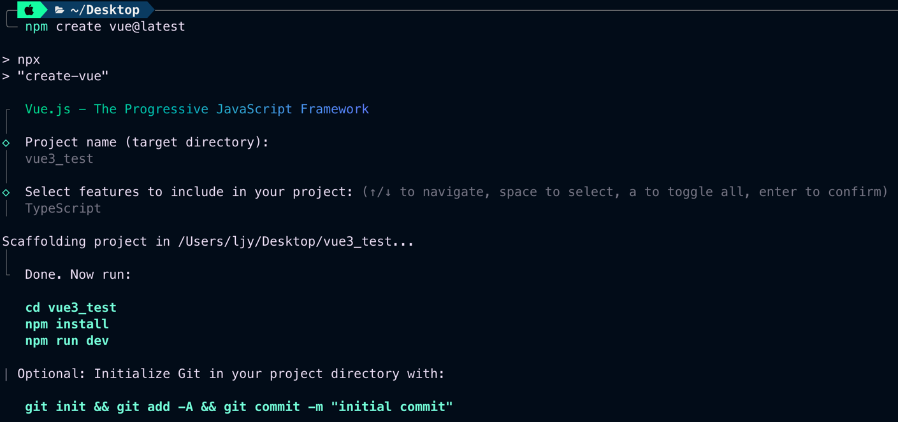
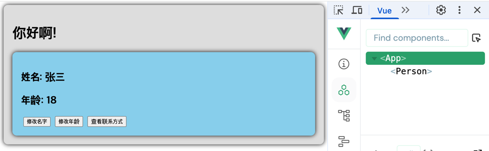
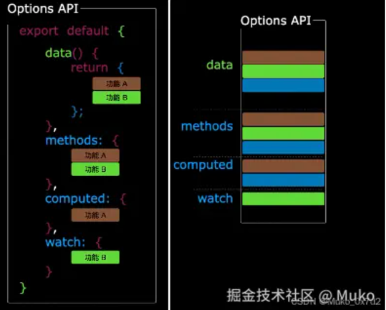
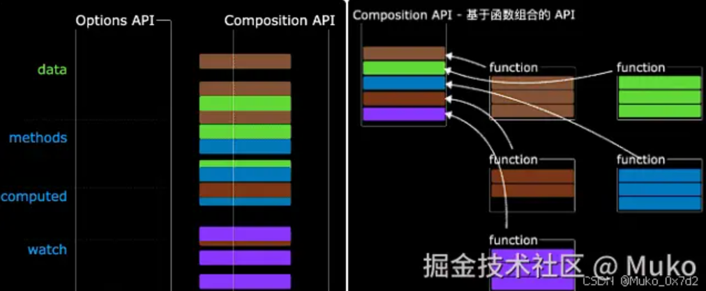

# 极简Vue3

## 01 Vue3开篇

## 02 Vue3简介

## 03 创建Vue3工程

```bash
# 1. 创建命令
npm create vue@latest

# 2. 配置项目名称
```



## 04 编写App组件

- 应用入口: `index.html`

```html
<!DOCTYPE html>
<html lang="">
<head>
  <meta charset="UTF-8">
  <link rel="icon" href="/favicon.ico">
  <meta name="viewport" content="width=device-width, initial-scale=1.0">
  <title>Vite App</title>
</head>
<body>
<div id="app"></div>
<script type="module" src="src/main.ts"></script>
</body>
</html>
```

- 脚本: `main.ts`

```ts
// 引入createApp用于创建应用
import { createApp } from 'vue'
// 引入App根组件
import App from './App.vue'

createApp(App).mount('#app')
```

- 组件: `App.vue`

```vue

<template>
  <!-- html -->
  <div class="app">
    <h1>你好啊!</h1>
  </div>
</template>

<script lang="ts">
  // JS或TS
  export default {
    name: 'App', // 组件名
  }
</script>

<style>
  /* 样式 */
  .app {
    background-color: #ddd;
    box-shadow: 0 0 10px;
    border-radius: 10px;
    padding: 20px;
  }
</style>
```

## 05 一个简单的效果



- 本案例使用`Vue2`的语法实现了一个简单的效果。

## 06 OptionsAPI与CompositionAPI

- Options API的弊端
- `Options`类型的`API`，数据、方法、计算属性等，是分散在`data`、`method`、`computed`中等，  
  若想新增或者修改一个需求，就需要分别修改: `data`、`methods`、`computed`，不便于维护和复用。



- Composition API的优势
- 可以用函数的方式，更加优雅地组织代码，让相关功能的代码更加有序地组织在一起。
  


